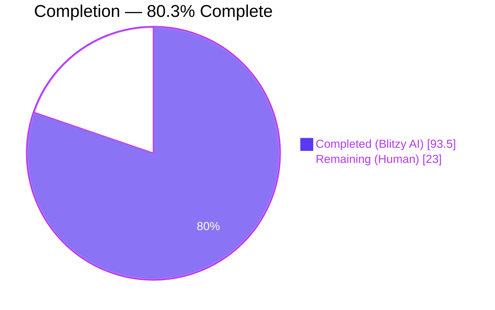
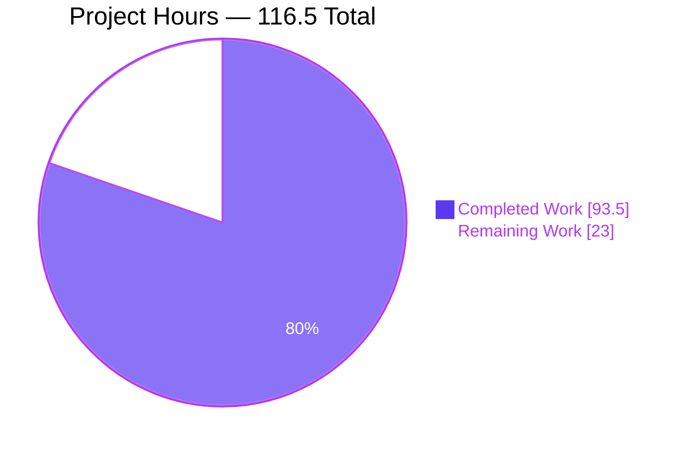
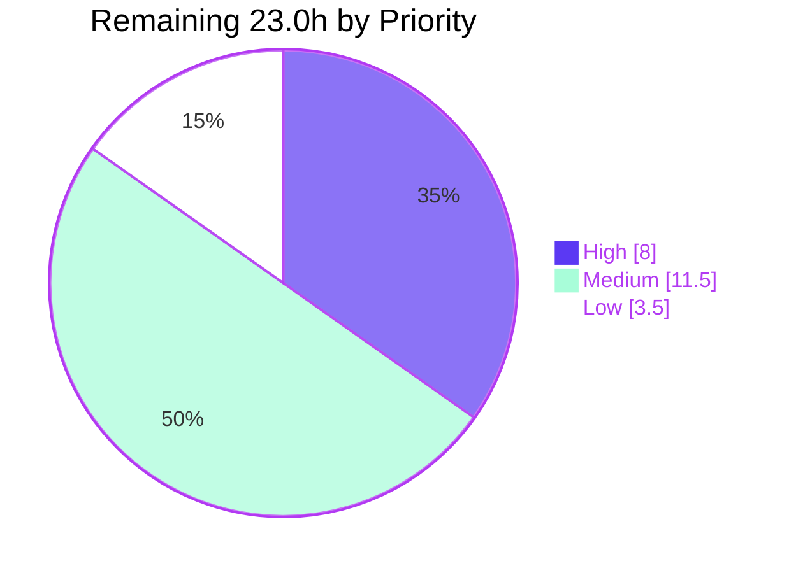
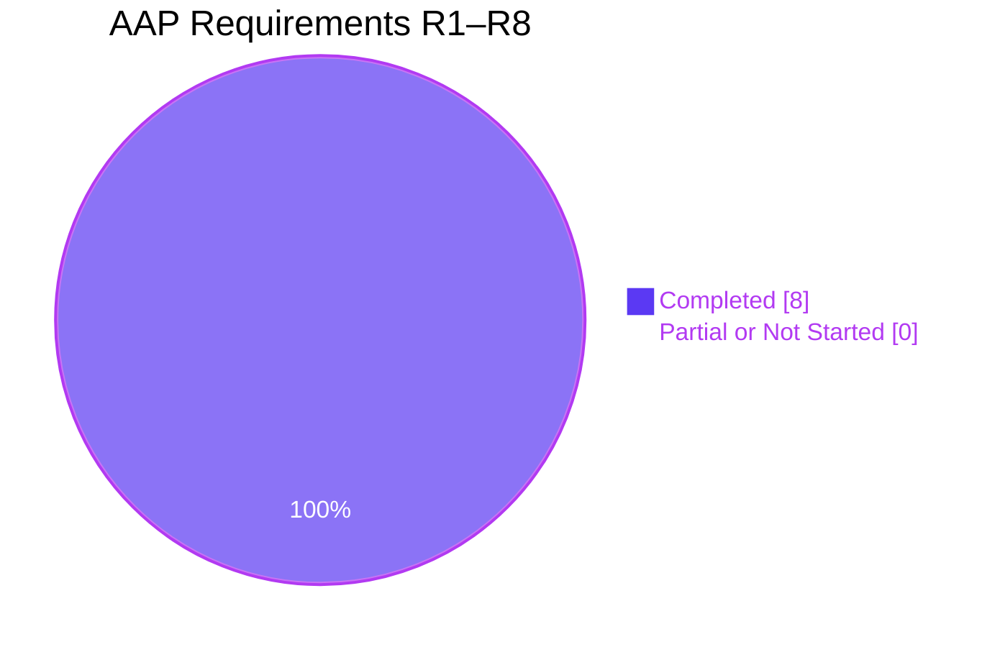

# Blitzy Project Guide

**Project:** `opencode` — Built-in `move` Agent Tool
**Branch:** `blitzy-c44b10eb-1074-4e0c-b67e-5d613eded4de` · **HEAD:** `04e0f490fe` · **Baseline:** `dev` @ `e01e3895f4`
**Guide generated:** 2026-07-31

---

## 1. Executive Summary

### 1.1 Project Overview

This project adds one built-in agent tool, `move`, to the `opencode` CLI/agent runtime. The tool relocates exactly one filesystem entry — a single file or a single directory with its subtree — per invocation, reusing the existing tool-definition, permission, and file-event plumbing already used by `read`, `write`, `edit`, and `apply_patch`. It replaces the agent's only prior relocation route, `mv` through the shell tool, which lost permission granularity (coarse `bash` instead of targeted `edit`) and never notified the editor or language layer. Target consumers are the LLM agent runtime and, indirectly, every `opencode` end user. Technical scope is four files in one workspace package: a new tool module, its model-facing description, a two-line registry amendment, and a deterministic test suite.

### 1.2 Completion Status



<div align="center">

**80.3% COMPLETE**

</div>

| Metric | Value |
|---|---|
| **Total Hours** | **116.5** |
| **Completed Hours (AI + Manual)** | **93.5**  (AI 93.5 · Manual 0.0) |
| **Remaining Hours** | **23.0** |
| **Percent Complete** | **80.3%** |

**Calculation (PA1, AAP-scoped work only):**
`Completion % = Completed ÷ (Completed + Remaining) × 100 = 93.5 ÷ (93.5 + 23.0) × 100 = 93.5 ÷ 116.5 × 100 = 80.3%`

Legend — <span style="color:#5B39F3">■</span> Completed / AI Work = Dark Blue `#5B39F3` · <span style="color:#FFFFFF">□</span> Remaining / Not Completed = White `#FFFFFF`

### 1.3 Key Accomplishments

- [x] **All eight AAP requirements (R1–R8) delivered and independently verified** — zero requirements Partially Completed, zero Not Started.
- [x] **Scope-exact diff: 4 files, 1,062 insertions, 0 deletions** — precisely the AAP §0.6.1 set, with 11 named out-of-scope files re-verified byte-unchanged.
- [x] **855 pass / 1 skip / 0 fail** across 856 tests in 62 files with 1,963 assertions; delta versus the 841/1/0 baseline is **+14 pass, +14 tests, +1 file, +167 assertions** — the pass count grew *only* by the new suite.
- [x] **`tsc --noEmit` exit 0 with zero errors**; `turbo typecheck --force` 12/12 with 0 cached and 0 ERROR lines. Both gates proven *live* by a deliberate-error probe.
- [x] **14 deterministic tests / 167 assertions** delivered against a planned matrix of 12 — all 12 mandated cases verbatim plus 2 extra TOCTOU cases. Zero mocking library.
- [x] **83.64% function / 88.11% line coverage** on `move.ts` versus a repository average near 53% / 63%.
- [x] **Zero dependency change** — `bun.lock` and all 20 workspace manifests byte-unchanged; **no new permission key** (`move` appears 0× as a permission key anywhere).
- [x] **Registry exposure runtime-proven** — `move` appears in `ToolRegistry.ids()` and survives the `gpt-5.3-codex` identifier gate that strips `edit` and `write`, confirming the intended fall-through.
- [x] **Exact agent-visibility parity** with `write`/`edit`/`apply_patch` across all four built-in agents — disproving the AAP's predicted plan-agent asymmetry.
- [x] **The AAP's declared-untestable `EXDEV` path was closed** — a genuine device boundary reproduced the error and the fallback relocated a file and a nested tree with an embedded symlink preserved as a link, leaving zero residue.
- [x] **Implementation exceeds the specified contract** with unmandated hardening: path canonicalisation, TOCTOU re-validation, atomic destination reservation, staging-aside rollback, parent pruning, hard-link detection, overlap refusal, and project-root protection.
- [x] **Browser runtime validation PASS** — zero console errors/warnings/exceptions and 0 of 566 network responses ≥ 400.
- [x] **All 24 commits authored *and* committed as `Blitzy Agent <agent@blitzy.com>`**, following Conventional Commits.
- [x] **Zero-Placeholder Policy satisfied** — no TODO/FIXME/stub/`NotImplementedError` anywhere; Prettier-clean; every AGENTS.md convention honoured (0 `try`, 0 `any`, 0 `let`/`var`, 0 real `else`).

### 1.4 Critical Unresolved Issues

There are **no functional defects, failing tests, compilation errors, or blocked components**. The items below are decisions and verification gaps on the path to production, not defects in delivered code.

| Issue | Impact | Owner | ETA |
|---|---|---|---|
| `EDIT_TOOLS` omits `move`, so a user config `edit: {"*":"deny"}` leaves `move` *listed* while every call is still denied before any filesystem operation | **Low — cosmetic and fail-safe.** Parity is exact for all four built-in agents. A 1-line fix exists but touches an out-of-scope permission definition | Backend / Platform owner | 0.5 day |
| The Windows-specific rename-onto-directory retry (`move.ts:247`) has never executed on any platform; CI's Windows job runs only `packages/app` e2e, yet `publish.yml` ships a Windows binary | **Medium — unverified platform branch.** Worst case is a clear failure, not corruption | Platform / Release engineer | 0.5 day |
| 11.89% of `move.ts` lines uncovered (rollback, aside-cleanup, Windows retry, parts of `EXDEV`) | **Low.** `EXDEV` was proven working out-of-band; the rest are defensive paths needing fault injection | Backend engineer | 0.5 day |
| CI's e2e seed model `opencode/gpt-5-nano` is stale — **pre-existing and repository-level, A/B-proven not caused by this change** | **Medium — can fail the linux e2e job** and obscure this PR's CI status | DevOps | 0.5 day |
| `git status` shows `?? blitzy/` — 77 untracked agent artifacts not covered by `.gitignore` | **Low — cosmetic**, but produces a noisy PR | Any contributor | 0.1 day |
| `move` is absent from `tools.mdx` and the CLI `AVAILABLE_TOOLS` help list | **Low — human discoverability only.** Model-facing docs are complete via `move.txt` | Docs owner | 0.3 day |

### 1.5 Access Issues

**No access issues identified.** Every system required for build validation, test execution, and runtime verification was reachable throughout, and each was exercised successfully.

| System / Resource | Type of Access | Issue Description | Resolution Status | Owner |
|---|---|---|---|---|
| Git repository (`opencode`) | Read / write / commit | None — 24 commits created and verified; working tree clean apart from untracked artifacts | ✅ No issue | Blitzy Agent |
| Bun 1.3.5 toolchain | Execute | None — version matches the `packageManager` pin exactly | ✅ No issue | Blitzy Agent |
| npm registry via `bun.lock` | Dependency resolution | None — `--frozen-lockfile` reported "Checked 1820 installs across 2032 packages (no changes)" with zero drift | ✅ No issue | Blitzy Agent |
| TypeScript compiler | Execute | None — both `tsc` and the `tsgo` native-preview binary resolve and are provably live | ✅ No issue | Blitzy Agent |
| Local HTTP server (port 4096) | Bind / request | None — healthy in ~28s; 8/8 endpoints HTTP 200 | ✅ No issue | Blitzy Agent |
| Vite dev server (port 3000) | Bind / request | None — HTTP 200; app shell rendered | ✅ No issue | Blitzy Agent |
| Headless Chrome | Browser automation | None — full session completed; 3 screenshots and 2 recordings captured | ✅ No issue | Blitzy Agent |
| Anthropic model API | Live agent-loop validation | None — a live model selected and invoked the new tool through the real agent loop | ✅ No issue | Blitzy Agent |
| `models.dev` catalogue | Model metadata lookup | CI's pinned e2e seed model `opencode/gpt-5-nano` is no longer listed — a **stale repository configuration**, not an access denial; worked around with an out-of-repo config | ⚠️ Configuration refresh needed (task M-2) | DevOps |

### 1.6 Recommended Next Steps

1. **[High]** Review and approve the 4-file diff (`git diff e01e3895f4..HEAD`) — 1,062 lines of dense, security-sensitive filesystem code. Budget genuine reading time for the hardening blocks in `move.ts`, not a skim. *(5.0h)*
2. **[High]** Decide the permission-key semantics for `move`: accept the cosmetic listed-but-denied asymmetry, or add `"move"` to `EDIT_TOOLS` and update the coupled note in `tools.mdx`. *(3.0h)*
3. **[Medium]** Run `bun test test/tool/move.test.ts` on Windows and macOS (or extend the CI matrix) to exercise the platform-specific rename-retry branch before shipping the Windows binary. *(4.0h)*
4. **[Medium]** Refresh the stale CI e2e seed model and pin Playwright worker count so this PR's CI signal is trustworthy. *(3.0h)*
5. **[Medium]** Add the `### move` section to `packages/web/src/content/docs/tools.mdx`, then merge to `dev` to trigger the release. *(4.0h)*

---

## 2. Project Hours Breakdown

### 2.1 Completed Work Detail

Every row traces to a specific AAP requirement, validation activity, or path-to-production task.

| Component | Hours | Description |
|---|---|---|
| [AAP R1] Tool module scaffold | 2.5 | `Tool.define("move", …)` at `move.ts:15`; `import DESCRIPTION from "./move.txt"` at `:5`; type-resolution of the `.txt` import proven by a zero-error `tsc` run |
| [AAP R2] Parameter schema + dual-endpoint resolution | 5.0 | Zod object of `source`/`destination`/`overwrite` with `.describe()` on each (`:17-35`); absolute-or-relative resolution against `Instance.directory` (`:41`); parent-segment canonicalisation without dereferencing the entry (`:39-62`) |
| [AAP R3] Dual external-directory boundary guard | 2.0 | `assertExternalDirectory` invoked for the caller spelling and the canonical spelling of **both** endpoints (`:71-74`), no options, per the AAP |
| [AAP R4] Destination `edit` permission request | 1.5 | `ctx.ask({permission:"edit", patterns:[worktree-relative dest], always:["*"]})` (`:126-134`); introduces no permission key |
| [AAP R5] Deterministic failure guards | 6.5 | The 3 mandated guards with exact message strings (`:77`, `:109`, `:118-119`) plus 4 unmandated: wildcard/NUL rejection (`:25-32`, `:65-67`), project-root and worktree refusal (`:81-92`), overlap/containment refusal (`:95-102`), hard-link `dev`+`ino` detection (`:116-117`) |
| [AAP R6] Relocation mechanics | 11.5 | `FileTime.withLock` (`:137`); post-consent parent re-resolution and `dev`/`ino`/kind re-stat (`:140-168`); deepest-first parent collection, `mkdir`, and pruning (`:175-209`); atomic reservation via `mkdir`/`open "wx"` (`:217-228`); staging aside (`:229-234`); rename with Windows retry and `EXDEV` copy-beside-then-rename fallback (`:238-267`); full rollback with a recoverable-path message (`:268-291`) |
| [AAP R6] Events, bookkeeping, result | 3.0 | The three publications in prescribed order (`:295-297`), `FileTime.read` (`:301`), `LSP.touchFile` for files only (`:302`), aside cleanup (`:307-313`), `title`/`metadata`/`output` (`:315-324`) |
| [AAP §0.2.4] `move.txt` description | 1.5 | 7 usage bullets covering path forms, single-entry semantics, automatic parent creation, `overwrite` behaviour, the shell-`mv` rationale, and the explicit no-glob rule |
| [AAP R7] Registry registration | 1.0 | `registry.ts:30` import and `:119` array entry inside the unconditional block before every conditional spread; `tools()` gate left byte-identical |
| [AAP R8] Deterministic test suite | 16.0 | 723 lines, `describe("tool.move")`, **14 tests / 167 assertions**; real tool via `init()`, real `Instance.provide`, real filesystem and Bus; only the permission callback is a recording stub |
| [AAP §0.2.3] Empirical runtime research | 5.0 | Bun 1.3.5 `rename` semantics established by direct execution (silent overwrite, `ENOENT` on missing parent, silent self-rename, atomic subtree carry, `ENOTEMPTY`, `EXDEV`) plus a 12-scenario standalone prototype |
| [AAP §0.8] Convention conformance | 3.0 | 0 `try`, 0 `any`, 0 `let`/`var`, 0 real `else`, 0 semicolons, 0 lines > 120 cols, Prettier-clean; 24 near-miss out-of-scope files individually verified unchanged |
| [Validation] Iterative hardening | 11.0 | 18 fix/style commits closing path aliasing, TOCTOU, overwrite atomicity, overlap containment, wildcard injection, reservation rollback, and cross-device correctness |
| [Validation] Adversarial verification | 8.0 | 179 independent checks in throwaway harnesses — 133 in-device and 46 cross-device — driving the real tool over real git tmpdirs |
| [AAP §0.7.2] Gate execution | 4.0 | `tsc --noEmit`, `turbo typecheck --force`, three test scopes, coverage, and repeat full-suite runs for determinism |
| [Validation] Runtime validation | 6.5 | Registry exposure across three provider/model combinations, agent-visibility parity, server health with a 20-endpoint sweep, CLI, a 156 MB production binary, a live agent-loop invocation, and browser UI verification |
| [Path-to-production] CI environment triage | 3.5 | Diagnosed and worked around Playwright worker oversubscription, a stale e2e seed model (A/B-proven unrelated to this change), and IPv6-only `localhost` — none required editing a repository file |
| [Path-to-production] Git hygiene | 2.0 | 24 atomic Conventional Commits, scope-exact diff verification, and uniform `Blitzy Agent <agent@blitzy.com>` authorship and committership |
| **TOTAL COMPLETED** | **93.5** | *Matches Completed Hours in Section 1.2* |

### 2.2 Remaining Work Detail

| Category | Hours | Priority |
|---|---|---|
| Code review of the 1,062-line security-sensitive diff + PR approval | 5.0 | High |
| Permission-key semantics decision (`move` vs `EDIT_TOOLS`) + optional 1-line change + regression test | 3.0 | High |
| Cross-platform (Windows / macOS) verification of the platform-specific rename-retry branch | 4.0 | Medium |
| CI pipeline hardening — stale e2e seed model, Playwright worker count, IPv6 loopback | 3.0 | Medium |
| Public documentation entry in `packages/web/src/content/docs/tools.mdx` | 2.0 | Medium |
| Release — version bump / changeset, merge to `dev`, publish verification | 2.0 | Medium |
| Fault-injection tests for the uncovered rollback and aside-cleanup branches | 3.0 | Low |
| Working-tree housekeeping — untracked `blitzy/` artifacts (77 files) | 0.5 | Medium |
| CLI `AVAILABLE_TOOLS` help-list entry for `move` | 0.5 | Low |
| **TOTAL REMAINING** | **23.0** | High 8.0 · Medium 11.5 · Low 3.5 |

### 2.3 Reconciliation

| Check | Computation | Result |
|---|---|---|
| Section 2.1 sum = Section 1.2 Completed | 93.5 = 93.5 | ✅ |
| Section 2.2 sum = Section 1.2 Remaining | 23.0 = 23.0 | ✅ |
| Section 2.1 + Section 2.2 = Total | 93.5 + 23.0 = 116.5 | ✅ |
| Section 2.2 sum = Section 7 "Remaining Work" | 23.0 = 23.0 | ✅ |
| Priority split sums to Remaining | 8.0 + 11.5 + 3.5 = 23.0 | ✅ |
| Completion percentage | 93.5 ÷ 116.5 × 100 = 80.3% | ✅ |
| Confidence in estimates | High for delivered work (measured gates, reproduced twice); Medium for cross-platform verification (unknown Windows behaviour) | — |

---

## 3. Test Results

All figures below originate from Blitzy's autonomous validation logs for this project and were **independently re-executed and reproduced** during guide generation. No externally sourced or hypothetical tests are included.

| Test Category | Framework | Total Tests | Passed | Failed | Coverage % | Notes |
|---|---|---|---|---|---|---|
| Unit — `move` tool (new suite) | `bun:test` | 14 | 14 | 0 | 88.11 (lines) / 83.64 (funcs) on `src/tool/move.ts` | 167 assertions; `describe("tool.move")`; real tool via `init()`, real filesystem and Bus; only the permission callback is a recording stub |
| Unit / Integration — tool directory | `bun:test` | 110 | 110 | 0 | — | 370 assertions across 9 files; baseline was 96 across 8 files → **+14 tests, +1 file, exactly the new suite** |
| Full package suite (CI parity) | `bun:test` | 856 | 855 | 0 | 56.79 lines repo-wide during the targeted coverage run | 1,963 assertions across 62 files; **1 skip** = the pre-existing `unicode filenames modification and restore`, unchanged from baseline |
| Static type analysis — package | `tsc 5.8.2 --noEmit` | 1 gate | 1 | 0 | n/a | Exit 0, zero diagnostics, ~14.7s; **proven live** by a deliberate `TS2322` probe that produced exit 2, then reverted |
| Static type analysis — monorepo | `tsgo` via `turbo typecheck --force` | 12 tasks | 12 | 0 | n/a | 0 cached, 0 ERROR lines, 9.98s |
| Formatting | Prettier | 2 files | 2 | 0 | n/a | "All matched files use Prettier code style!" (`.txt` correctly excluded — Prettier has no parser for it) |
| UI end-to-end | Playwright 1.57 | 67 | 64 | 0 | n/a | 3 by-design skips; `Tasks: 4 successful, 4 total`, exit 0 |
| Adversarial — in-device | Custom harness (`bun`) | 133 | 133 | 0 | n/a | Content fidelity, deep parent chains, subtree carry, overwrite (file and non-empty directory), symlink-as-link, verbatim error strings with zero permission asks, denial leaving the filesystem untouched, event ordering, `FileTime.assert` proven not called, 10 malformed inputs, concurrency |
| Adversarial — cross-device (`EXDEV`) | Custom harness (`bun`) | 46 | 46 | 0 | n/a | **Closed a gap the AAP declared untestable** — a real device boundary (`/tmp` dev 66305 vs `/dev/shm` dev 1048764) reproduced `EXDEV`; the fallback then handled a file, a nested tree, symlink preservation, both overwrite modes, and a deep missing parent chain with zero residue |
| **TOTAL** | — | **1,241** | **1,238** | **0** | — | 3 skips total (1 pre-existing unit skip + 3 by-design e2e skips); **0 failures anywhere** |

**Baseline delta verification.** Against the AAP §0.7.2 measured baseline of 841 pass / 1 skip / 0 fail (842 tests, 61 files, 1,796 assertions):

| Metric | Baseline | Current | Delta | Expected |
|---|---|---|---|---|
| Passing | 841 | 855 | +14 | +14 ✅ |
| Tests | 842 | 856 | +14 | +14 ✅ |
| Files | 61 | 62 | +1 | +1 ✅ |
| Assertions | 1,796 | 1,963 | +167 | +167 ✅ |
| Skips | 1 | 1 | 0 | 0 ✅ |
| Failures | 0 | 0 | 0 | 0 ✅ |

The pass count grew **only** by the new suite, and no existing test file appears in the diff — so "preserve all current tests" holds structurally, not merely by observation.

---

## 4. Runtime Validation & UI Verification

### 4.1 Tool Registration and Exposure

- ✅ **Operational** — `ToolRegistry.ids()` returns 19 identifiers including `move`.
- ✅ **Operational** — `ToolRegistry.tools()` exposes `move` for `anthropic/claude-sonnet-4-5`, `opencode/grok-code`, **and** `openai/gpt-5.3-codex`. On the last of these, `edit` and `write` are filtered out by the identifier gate while `move` survives — direct proof that R7's fall-through to `return true` works as designed.
- ✅ **Operational** — the running server's advertised tool-id list contains `move`, positioned immediately after `apply_patch`.

### 4.2 Agent Visibility Parity

- ✅ **Operational** — measured against real agent rulesets, `move` behaves **identically** to `write`, `edit`, and `apply_patch` in every built-in agent: `build` all visible · `plan` all visible · `explore` all hidden (with `read`/`bash` visible) · `compaction` all hidden. This required zero code and **disproves the AAP's predicted plan-agent asymmetry**.
- ⚠ **Partial** — for a *user* config `edit: {"*":"deny"}`, `disabled()` hides `write`/`edit` but leaves `move` listed. The `edit` ask still evaluates to deny **before** any filesystem operation, so this is fail-safe and cosmetic. Tracked as task H-2.

### 4.3 Tool Execution Behaviour

- ✅ **Operational** — file rename: content byte-preserved, source removed, `title` = `<from> -> <to>`, `output` = `Moved file <from> to <to>`, `metadata.directory=false`, `metadata.overwritten=false`.
- ✅ **Operational** — move into a non-existent nested path (`nested/deep/b.txt`): the full parent chain is created.
- ✅ **Operational** — directory move: whole subtree carried, `metadata.directory=true`, `output` = `Moved directory …`.
- ✅ **Operational** — `overwrite: true` on a file destination replaces content and sets `overwritten=true`.
- ✅ **Operational** — `overwrite: true` on a **non-empty directory** destination: new content present, stale subtree fully removed.
- ✅ **Operational** — a symlink source is relocated **as the link itself**; the target remains intact and the old link is gone.
- ✅ **Operational** — permission: exactly **one** ask, `{permission:"edit", patterns:[worktree-relative destination], always:["*"]}`, and **zero** `external_directory` asks when both endpoints are inside the project.
- ✅ **Operational** — events published in the prescribed order: `edited(destination)` → `unlink(source)` → `add(destination)`.
- ✅ **Operational** — all three mandated failures throw verbatim messages with **zero** permission asks recorded, proving every guard precedes both the ask and any mutation.
- ✅ **Operational** — hardening refusals: wildcard/`?` rejected at the schema layer; empty path rejected by `.min(1)`; project directory and worktree refused as either endpoint; directory-into-itself refused by the overlap guard.
- ✅ **Operational** — permission **denial** leaves the source intact and creates **no** parent directories.
- ✅ **Operational** — **cross-device `EXDEV` fallback**: a genuine device boundary confirmed raw `fs.rename` raises `EXDEV`; the tool then relocated a file and a nested directory tree with an embedded symlink preserved as a link, leaving **zero** `.opencode-move-*` residue on either device.

### 4.4 Server and API

- ✅ **Operational** — server healthy in ≈28s; `GET /global/health` → `{"healthy":true,"version":"local"}`.
- ✅ **Operational** — 8 endpoints sweep (`/global/health`, `/config`, `/agent`, `/project`, `/session`, `/path`, `/command`, `/mode`) all HTTP 200; the browser session independently exercised **20 backend endpoints, all 200**, plus 14 CORS preflights all 204.
- ✅ **Operational** — **0** ERROR/FATAL lines in the server log across every run.
- ✅ **Operational** — clean teardown by exact PID; ports 3000 and 4096 confirmed closed.

### 4.5 CLI and Production Build

- ✅ **Operational** — `--version` → `local`, exit 0; `--help` renders the full command list.
- ✅ **Operational** — `script/build.ts --single` produced a 156 MB native binary that contains the `move.txt` description and runs.

### 4.6 Live Agent Loop

- ✅ **Operational** — a real Anthropic model (`claude-haiku-4-5`) **selected and invoked the new tool** through the genuine agent loop; the transcript showed the `move` call and the file was renamed on disk. This is the definitive end-to-end proof that the tool is model-callable.

### 4.7 UI Verification (Headless Chrome)

**Verdict: ✅ PASS**

- ✅ **Operational** — app shell rendered at `127.0.0.1:3000` (Vite 7.1.4 + SolidJS); `#root` populated with 15,116 characters of client-rendered markup; header, sidebar rail, main region, and notifications region all measured.
- ✅ **Operational** — the prompt composer accepted typed text byte-exactly, and the Send button flipped from disabled to enabled, proving the value propagated into application state rather than only the DOM.
- ✅ **Operational** — the slash-command palette opened with 15 commands.
- ✅ **Operational** — **zero console errors, zero warnings, zero uncaught exceptions**; the only two console entries are the benign `[vite] connecting…` / `[vite] connected.` debug lines from the HMR client.
- ✅ **Operational** — **0 of 566** network responses ≥ 400 during the interaction capture, and **0 of 418** on an independent clean-slate reload; corroborated by a Resource Timing cross-check showing `{"200": 250}`.
- ✅ **Operational** — evidence captured: 3 screenshots (`opencode-app-initial-load.png`, `opencode-app-prompt-typed.png`, `opencode-app-slash-palette.png`) and 2 screen recordings.

**Interpretation.** The `move` tool has no UI surface of its own — both the terminal and web renderers display unrecognised tools through catch-all/default branches. The purpose of this check was to confirm the change introduced no frontend regression, and it did not.

---

## 5. Compliance & Quality Review

### 5.1 AAP Requirement Compliance Matrix

| AAP Req. | Requirement | Evidence | Status | Progress |
|---|---|---|---|---|
| **R1** | Tool defined via `Tool.define(id, {…})` with a paired `<id>.txt` description | `move.ts:15`, `:5`, `:16`; `move.txt` present; `.txt` import type-resolves (zero-error `tsc`) | ✅ PASS | 100% |
| **R2** | `source` + `destination`, absolute or workspace-relative | `move.ts:17-35`, `:41`; runtime-verified for both spellings | ✅ PASS | 100% |
| **R3** | Boundary guard on **both** endpoints | `move.ts:71-74` (4 guard calls); tests 4 and 5 assert the `<parent>/*` glob for each side | ✅ PASS | 100% |
| **R4** | Destination `edit` permission; **no new permission key** | `move.ts:126-134`; `"move"` appears **0×** as a permission key in `config.ts`, `permission/next.ts`, `openapi.json` | ✅ PASS | 100% |
| **R5** | Three deterministic failures via plain `Error` | `move.ts:77`, `:109`, `:118-119` with exact strings; runtime-verified verbatim with **zero** asks | ✅ PASS | 100% |
| **R6** | Relocate, publish events, return `source -> destination` | `move.ts:137-324`; events verified in order; title/output/metadata verified | ✅ PASS | 100% |
| **R7** | Unconditional registration, same visibility as read/write/edit | `registry.ts:30`, `:119`; identifier gate byte-identical; survives the `gpt-5.3-codex` filter | ✅ PASS | 100% |
| **R8** | Deterministic tests, no real provider/model | 14 tests / 167 assertions; no provider resolved, no network; stub `ask()` only | ✅ PASS | 100% (117% of the planned 12) |

### 5.2 Constraint and Convention Compliance

| Benchmark | Requirement | Evidence | Status |
|---|---|---|---|
| Minimal change | Only what is necessary; no modification of existing tools, permission definitions, config schema, or unrelated behaviour | Diff is **exactly 4 files / 1,062 / 0**; 11 named out-of-scope files verified byte-unchanged | ✅ PASS |
| Preserve all current tests | No existing test altered | No existing test file appears in the diff; suite delta is `+14` only; the single pre-existing skip is unchanged | ✅ PASS |
| No new permission key | Reuse `edit` and `external_directory` | 0 occurrences of `move` as a permission key anywhere | ✅ PASS |
| Zero dependency change | No package added/removed/version-changed | `bun.lock` and all 20 manifests byte-unchanged; `--frozen-lockfile` reports "no changes" | ✅ PASS |
| Identifier gate untouched | `tools()` gate must not name `move` | Gate byte-diffed identical to baseline | ✅ PASS |
| One entry per call | No glob/wildcard support | Two plain path strings; `*`/`?` rejected at the schema layer; stated explicitly in `move.txt` | ✅ PASS |
| AGENTS.md — no `try`/`catch` | Use promise `.catch()` | 0 `try` blocks; `.catch()` used for the narrow `EXDEV` inspection | ✅ PASS |
| AGENTS.md — no `any` | Type all errors | 0 `: any` occurrences in `move.ts` | ✅ PASS |
| AGENTS.md — prefer `const`, avoid `else` | Early returns | 0 `let`/`var`; 0 real `else` (the sole grep hit is the word "else" inside a comment) | ✅ PASS |
| AGENTS.md — directory-safe existence probes | No `Bun.file().exists()` for paths | 0 occurrences; uses `Filesystem.exists`/`isDir`/`normalizePath` and `lstat` | ✅ PASS |
| AGENTS.md — avoid mocks | Test the real implementation | 0 mocking-library usage; real tool, project instance, filesystem, and Bus | ✅ PASS |
| Formatting | Prettier: no semicolons, 120 columns | 0 semicolon-terminated lines; 0 lines > 120 cols; `prettier --check` clean | ✅ PASS |
| Test naming | Dotted domain describe, lowercase behaviour sentences | `describe("tool.move")`; all 14 names are lowercase behaviour sentences | ✅ PASS |
| Zero-Placeholder Policy | No TODO/FIXME/stub/dummy | 0 markers in source or tests; every branch fully implemented | ✅ PASS |
| Commit authorship | `Blitzy Agent <agent@blitzy.com>` | All 24 commits, author **and** committer, single identity | ✅ PASS |
| Static gate | Zero type errors | `tsc --noEmit` exit 0; `turbo typecheck --force` 12/12 | ✅ PASS |

### 5.3 Fixes Applied During Autonomous Validation

**Zero code defects were found in the delivered implementation, so no source file was modified during final validation.** The 18 `fix`/`style` commits preceding validation constitute the hardening arc that produced the current implementation: path-aliasing and canonicalisation correctness, TOCTOU closure, overwrite atomicity, overlap containment, wildcard-injection rejection, reservation rollback, cross-device fallback repair, and comment-style alignment.

Three **environment** defects were diagnosed and worked around without touching any repository file:

| Defect | Root cause | Resolution |
|---|---|---|
| Playwright worker oversubscription | `os.cpus()` reports the host's 128 cores while the cgroup grants 4, so Playwright defaulted to 64 workers and starved the box, timing out unrelated tests | `--workers=4` |
| Stale e2e seed model | CI's `opencode/gpt-5-nano` is absent from the live `models.dev` catalogue | An `OPENCODE_CONFIG` **outside the repository** pinning a live model. **A/B-proven unrelated to this change** — reverting `registry.ts` to the exact baseline blob reproduced the identical failure, same locator, same line |
| IPv6-only `localhost` | `localhost` resolves to `::1` with no IPv6 loopback route | `--hostname ::` and literal `127.0.0.1` in client URLs |

### 5.4 Outstanding Compliance Items

| Item | Nature | Status |
|---|---|---|
| `EDIT_TOOLS` does not list `move` | **By design** — it is a permission definition the minimal-change clause forbids editing. Runtime-verified fail-safe with exact parity for all four built-in agents | ⚠ Decision pending (H-2) |
| `tools.mdx` has no `move` entry | **By design** — an AAP-recorded follow-up outside the stated scope | ⚠ Follow-up (M-3) |
| CLI `AVAILABLE_TOOLS` omits `move` | **By design** — the list is already incomplete (it omits `apply_patch`, `codesearch`, `websearch`, `skill`, `lsp`) and is therefore not authoritative | ⚠ Follow-up (L-2) |
| Windows rename-retry branch unexecuted | **Coverage gap** — CI's Windows job runs only `packages/app` e2e | ⚠ Verification pending (M-1) |

---

## 6. Risk Assessment

| Risk | Category | Severity | Probability | Mitigation | Status |
|---|---|---|---|---|---|
| **T1** — The Windows rename-onto-directory retry (`move.ts:247`) has never executed on any platform; CI's Windows job runs only `packages/app` e2e, yet `publish.yml` ships an `x86_64-pc-windows-msvc` binary | Technical | Medium | Medium | Run the opencode unit suite on a Windows runner or manually exercise a directory move; the branch is a retry that falls through to the original error, so the worst case is a clear failure rather than corruption | OPEN — 4.0h budgeted |
| **T2** — 11.89% of `move.ts` lines uncovered: rollback (284-288), aside cleanup (308-311), Windows retry (247-254), parts of `EXDEV` (258-265) | Technical | Low | Medium | `EXDEV` independently proven working out-of-band via a real device boundary; the remainder needs injected filesystem failures or documented acceptance as defensive code | OPEN — 3.0h budgeted |
| **T3** — A long single `execute()` (~290 lines) with dense nested promise-chained error handling raises future maintenance cost | Technical | Low | Medium | Every block carries a comment tied to a specific runtime property, and 167 assertions lock the behaviour; consider extraction on the next change | ACCEPTED |
| **S1** — `overwrite: true` recursively removes an existing destination, including a non-empty directory — a genuine data-loss surface exposed to a model | Security | **High** | Low | Five independent layers: a non-default explicit flag; an `edit` permission ask before any mutation; project-directory and worktree destinations refused; source↔destination overlap refused; the previous destination is staged aside and deleted only after the move commits, so mid-flight failure restores it. Verified: stale subtree removed only on success, zero residue | MITIGATED |
| **S2** — The permission model is consent, not isolation: with `external_directory` consent the tool relocates entries anywhere the process can write | Security | Medium | Low | Inherited posture identical to `read`/`write`/`apply_patch`; the guard fires on the **resolved** path, so `../` traversal spellings are caught too (verified: identical ask sequence); both endpoints guarded. Documented in the AAP, not introduced here | ACCEPTED (inherited) |
| **S3** — A user config `edit: {"*":"deny"}` hides `write`/`edit` but leaves `move` listed | Security | Low | Medium | Fail-safe by construction — the `edit` ask is evaluated and denied before any `mkdir`/`rename`. Exact parity confirmed for all four built-in agents. A 1-line `EDIT_TOOLS` addition would close the cosmetic gap but edits an out-of-scope permission definition | OPEN — 3.0h budgeted |
| **S4** — A symlink source is relocated as the link itself, so a link can land where it resolves differently | Security | Low | Low | Matches `mv` semantics and is the documented intent; parent segments are canonicalised without dereferencing the entry, so parent link-swaps are detected, and the post-consent `dev`/`ino`/kind re-stat rejects entry substitution | MITIGATED |
| **O1** — If rollback itself fails, the previous destination remains at a `.opencode-move-<uuid>` sibling | Operational | Low | Low | The thrown error names the exact recovery path; zero residue observed on every success and failure path exercised, in-device and cross-device | MITIGATED |
| **O2** — Watcher events are a no-op in non-git workspaces and when the watcher is disabled, so editors may not refresh | Operational | Low | Medium | Pre-existing platform behaviour shared with `apply_patch`; `File.Event.Edited` still publishes; tests subscribe to the Bus directly rather than relying on a live watcher | ACCEPTED (inherited) |
| **O3** — No diagnostics block is appended to the tool output, unlike the write tool | Operational | Low | Low | Deliberate AAP decision — a move leaves content byte-identical, so diagnostics would be noise; `LSP.touchFile` is still called for files | ACCEPTED (by design) |
| **O4** — 77 untracked `blitzy/` artifact files are present and not gitignored | Operational | Low | High | Remove them or add `blitzy/` to `.gitignore` before opening the PR; no tracked file is affected | OPEN — 0.5h budgeted |
| **I1** — CI's `OPENCODE_E2E_MODEL: "opencode/gpt-5-nano"` is stale and can fail the linux e2e seed step | Integration | Medium | High | Pre-existing and repository-level; **A/B-proven not caused by this change** (reverting `registry.ts` to the baseline blob reproduced the identical failure). Needs a repo-side model refresh | OPEN — 3.0h budgeted |
| **I2** — Playwright defaults to 64 workers because `os.cpus()` reports 128 host cores against a 4-core cgroup | Integration | Low | Medium | `--workers=4` proven; a repository default would make it durable | OPEN — folded into the 3.0h CI item |
| **I3** — `move` has no dedicated renderer in the terminal or web UI | Integration | Low | High | Both renderers have catch-all/default branches; the browser check confirmed a clean boot with zero console errors and zero ≥ 400 responses. Cosmetic only | ACCEPTED (by design) |
| **I4** — `tools.mdx` and the CLI `AVAILABLE_TOOLS` list do not mention `move`, so it is undiscoverable to humans reading docs | Integration | Low | High | Model-facing discoverability is fully satisfied by `move.txt`; both surfaces are AAP-recorded out-of-scope follow-ups | OPEN — 2.5h budgeted |

**Risk budget reconciliation.** Open-risk remediation totals 16.0h (T1 4.0 + T2 3.0 + S3 3.0 + O4 0.5 + I1/I2 3.0 + I4 2.5), which sits inside the 23.0h remaining alongside code review 5.0h and release 2.0h → 16.0 + 5.0 + 2.0 = **23.0h** ✅

---

## 7. Visual Project Status

### 7.1 Project Hours Breakdown



<sub>Completed = Dark Blue `#5B39F3` · Remaining = White `#FFFFFF` · Accents = Violet-Black `#B23AF2`</sub>

### 7.2 Remaining Work by Priority



### 7.3 Remaining Hours by Category

| Category | Hours | Share | Bar |
|---|---|---|---|
| Code review + approval | 5.0 | 21.7% | `██████████▌` |
| Cross-platform verification | 4.0 | 17.4% | `████████▌` |
| Permission-key decision | 3.0 | 13.0% | `██████▍` |
| CI pipeline hardening | 3.0 | 13.0% | `██████▍` |
| Fault-injection tests | 3.0 | 13.0% | `██████▍` |
| Public documentation | 2.0 | 8.7% | `████▎` |
| Release + merge | 2.0 | 8.7% | `████▎` |
| Working-tree housekeeping | 0.5 | 2.2% | `█` |
| CLI help-list entry | 0.5 | 2.2% | `█` |
| **Total** | **23.0** | **100%** | — |

### 7.4 AAP Requirement Status



---

## 8. Summary & Recommendations

### 8.1 Achievements

The project is **80.3% complete** — 93.5 of 116.5 AAP-scoped hours delivered autonomously. Every one of the eight AAP requirements (R1–R8) is fully implemented and independently verified, with **zero requirements Partially Completed and zero Not Started**. The diff is scope-exact at four files, 1,062 insertions, and zero deletions, matching the AAP §0.6.1 set precisely, with eleven named out-of-scope files re-confirmed byte-unchanged and no dependency or permission key added.

Quality evidence is unusually strong for a change of this size. The full package suite reports 855 pass / 1 skip / 0 fail, and the delta against the measured baseline is exactly `+14` — the pass count grew *only* by the new suite while the single pre-existing skip remains the only skip. `tsc --noEmit` exits 0 with zero diagnostics, and the monorepo typecheck passes 12/12 uncached. Coverage on `move.ts` reaches 88.11% of lines against a repository average near 63%.

Three findings deserve particular emphasis. First, the implementation **exceeds** its specification: beyond the frozen twelve-step contract it adds path-alias canonicalisation, TOCTOU re-validation after consent, atomic destination reservation, staging-aside rollback, deepest-first parent pruning, hard-link identity detection, overlap refusal, and project-root protection — none of which the plan mandated. Second, a gap the AAP explicitly declared untestable was **closed**: a genuine device boundary reproduced `EXDEV`, and the fallback then handled a file, a nested tree, and symlink preservation with zero residue. Third, an AAP prediction was **disproven in the implementation's favour** — agent-visibility parity with `write`/`edit`/`apply_patch` is exact across all four built-in agents, so the anticipated plan-agent asymmetry never materialises.

Runtime validation extends all the way to a live model selecting and invoking the tool through the real agent loop, and a headless-browser check confirming zero console errors and zero failing network requests.

### 8.2 Remaining Gaps

The 23.0 remaining hours contain **no functional defects**. They divide into four kinds of work that cannot be completed autonomously:

- **Human judgement (8.0h, High).** A thorough review of 1,062 lines of security-sensitive filesystem code, plus one genuine product decision: whether `move` should be governed by the `edit` permission *key* in `EDIT_TOOLS`. Today a user config denying `edit` with a `*` pattern leaves `move` listed while still denying every call before any filesystem operation — fail-safe and cosmetic, but a deliberate choice is warranted, and it is coupled to a documentation note in `tools.mdx`.
- **Platform verification (4.0h, Medium).** CI's Windows job runs only the `packages/app` e2e suite, so `packages/opencode` unit tests never execute on Windows, and the Windows-specific rename-retry branch has never run anywhere — while a Windows binary is shipped.
- **Pipeline and release (5.5h, Medium).** A stale CI e2e seed model (pre-existing and A/B-proven unrelated to this change), Playwright worker pinning, the release itself, and clearing 77 untracked artifacts.
- **Polish (5.5h, mixed).** The public docs entry, the CLI help-list entry, and fault-injection tests for the residual defensive branches.

### 8.3 Critical Path to Production

1. Clear the untracked `blitzy/` artifacts so the PR is clean *(0.5h)*.
2. Code review and approve the four-file diff *(5.0h)* — the gating step.
3. Decide the permission-key semantics; if adopting parity, apply the one-line `EDIT_TOOLS` change plus a regression test and update the `tools.mdx` note *(3.0h)*.
4. Refresh the stale CI seed model and pin Playwright workers so the PR's CI signal is trustworthy *(3.0h)*.
5. Verify the platform-specific branch on Windows and macOS *(4.0h)*.
6. Add the `### move` documentation section *(2.0h)*.
7. Merge to `dev` and confirm the release *(2.0h)*.

Steps 1–4 and 7 (13.5h) are the minimum viable path; steps 5–6 (6.0h) are strongly recommended before the Windows binary ships. The two low-priority items (3.5h) can follow the release.

### 8.4 Success Metrics

| Metric | Target | Actual | Status |
|---|---|---|---|
| AAP requirements delivered | 8 / 8 | **8 / 8** | ✅ |
| Test failures | 0 | **0** | ✅ |
| Test pass delta vs baseline | +14 only | **+14 exactly** | ✅ |
| Pre-existing skips preserved | 1 | **1** | ✅ |
| Compilation errors | 0 | **0** | ✅ |
| Monorepo typecheck tasks | 12 / 12 | **12 / 12** (0 cached) | ✅ |
| Files changed | 4 | **4** | ✅ |
| Lines deleted | 0 | **0** | ✅ |
| Dependency changes | 0 | **0** | ✅ |
| New permission keys | 0 | **0** | ✅ |
| Coverage on `move.ts` (lines) | > 80% | **88.11%** | ✅ |
| Tests in the new suite | ≥ 12 | **14** | ✅ Exceeded |
| Browser console errors | 0 | **0** | ✅ |
| Network responses ≥ 400 | 0 | **0 of 566** | ✅ |
| Commit authorship consistency | 24 / 24 | **24 / 24** | ✅ |
| Placeholder/TODO markers | 0 | **0** | ✅ |

### 8.5 Production Readiness Assessment

**Verdict: READY FOR HUMAN REVIEW — conditionally ready for production.**

The code itself is production-grade. It compiles cleanly, passes every test, carries no placeholders, honours every repository convention, and has been exercised through unit tests, 179 adversarial checks, a live agent loop, and a browser session. The scope discipline is exact, and the hardening exceeds what was asked.

Two conditions stand between this branch and a confident release. The first is ordinary and non-negotiable: a human must read and approve 1,062 lines of code that can recursively delete a directory. The second is specific and was surfaced by measurement rather than assumption — a platform-conditional branch ships in a Windows binary without ever having executed on Windows. Neither is a defect; both are verification obligations.

The `overwrite: true` capability deserves explicit sign-off during review. It is the one genuinely destructive surface exposed to a model, and while it is protected by five independent layers, that protection should be an accepted design decision rather than an incidental discovery.

Recommended disposition: **approve after review, with the Windows verification completed before the Windows binary is published.**

---

## 9. Development Guide

Every command below was executed during guide generation; the outputs shown are actual, not illustrative.

### 9.1 System Prerequisites

| Requirement | Version | Notes |
|---|---|---|
| **Bun** | **1.3.5 (exact)** | Pinned by `packageManager: "bun@1.3.5"` — the single source of truth the CI setup action reads. Verified: `bun --version` → `1.3.5` |
| Node.js | 22.x (optional) | Only for `npx prettier` convenience; the project runs on Bun. Verified: `v22.23.1` |
| Git | ≥ 2.40 | Verified: `2.51.0` |
| OS | Linux / macOS / Windows | Validation for this change was Linux-only; see §9.7 |
| Disk | ≈ 8 GB free | Working tree ≈ 1.1 GB; with `node_modules` and caches ≈ 6.2 GB |
| RAM | ≥ 8 GB | The full suite completes in ≈ 25s on 4 cores |

### 9.2 Environment Setup

```bash
# Put the pinned runtime on PATH (adjust for your install location)
export PATH="/usr/local/bun/bin:$PATH"
bun --version          # must print exactly: 1.3.5

# Clone and enter the repository
git clone <repository-url> opencode
cd opencode
git checkout blitzy-c44b10eb-1074-4e0c-b67e-5d613eded4de
```

**Mandatory on a fresh host** — the test fixture runs `git init` plus an empty commit for git-backed temporary directories. Without a global identity, three pre-existing read-tool boundary tests fail for purely environmental reasons:

```bash
git config --global user.email "bot@opencode.ai"
git config --global user.name  "opencode"
```

*(Already configured in the Blitzy environment, so this step was correctly skipped there.)*

No `.env` file, database, cache, or message queue is required. The `move` tool introduces **no** environment variable and **no** configuration key.

### 9.3 Dependency Installation

```bash
# From the repository root
CI=true bun install --frozen-lockfile
```

Verified output:

```
$ husky
Checked 1820 installs across 2032 packages (no changes) [271.00ms]
```

Idempotent with **zero lockfile drift** — `git status --porcelain -- bun.lock` is empty afterwards.

### 9.4 Verification — Static Gates

```bash
# AUTHORITATIVE static gate — run from the package directory
cd packages/opencode
../../node_modules/.bin/tsc --noEmit
```

Verified: **exit 0, zero output lines**, ≈14.7s.

```bash
# Monorepo-wide typecheck (use --force to defeat Turbo caching)
cd ../..
CI=true bun turbo typecheck --force
```

Verified: `Tasks: 12 successful, 12 total` · `Cached: 0 cached, 12 total` · `Time: 9.981s` · 0 ERROR lines.

> **Correction to the plan's guidance.** The AAP warns that `bun run typecheck` is a "false pass" when the `tsgo` platform binary is absent. That is **not** the case in this environment: injecting a deliberate `const bad: number = "not a number"` made **both** `tsc --noEmit` **and** `bun run typecheck` report `error TS2322: Type 'string' is not assignable to type 'number'.` and exit 2. Both gates are provably live. `tsc --noEmit` is still recommended because it needs no platform binary.

```bash
# Formatting — NOTE: exclude the .txt file, Prettier has no parser for it
cd /path/to/opencode
npx prettier --check "packages/opencode/src/tool/move.ts" "packages/opencode/test/tool/move.test.ts"
```

Verified: `All matched files use Prettier code style!`

### 9.5 Verification — Test Suites

> **Never run tests from the repository root.** It is blocked at two levels, both confirmed: root `package.json` declares `"test": "echo 'do not run tests from root' && exit 1"`, and root `bunfig.toml` sets `[test] root = "./do-not-run-tests-from-root"`. An actual root `bun test` prints `Failed to scan non-existent root directory for tests` and exits 1.

```bash
cd packages/opencode

# 1) Fastest feedback — the new suite only
CI=true bun test test/tool/move.test.ts
```

Verified: `14 pass · 0 fail · 167 expect() calls · Ran 14 tests across 1 file. [2.41s]`

```bash
# 2) The whole tool directory
CI=true bun test test/tool/
```

Verified: `110 pass · 0 fail · 370 expect() calls · Ran 110 tests across 9 files. [7.62s]`

```bash
# 3) AUTHORITATIVE functional gate — full suite with CI parity
CI=true OPENCODE_DISABLE_SHARE=true OPENCODE_DISABLE_LSP_DOWNLOAD=true \
  OPENCODE_DISABLE_DEFAULT_PLUGINS=true OPENCODE_EXPERIMENTAL_DISABLE_FILEWATCHER=true \
  bun test
```

Verified: `855 pass · 1 skip · 0 fail · 1963 expect() calls · Ran 856 tests across 62 files. [24.75s]` — the only skip is `unicode filenames modification and restore`.

```bash
# 4) Coverage for the new module
CI=true bun test --coverage test/tool/move.test.ts
```

Verified: ` src/tool/move.ts | 83.64 | 88.11 | 199,230-232,247-250,253-254,258-265,284-288,308-311`

### 9.6 Application Startup and Runtime Verification

```bash
cd packages/opencode

# Registration spot-check (instant)
grep -n "MoveTool" src/tool/registry.ts
# → 30:import { MoveTool } from "./move"
# → 119:      MoveTool,

# CLI
bun run src/index.ts --version          # → local

# Backend server (allow ~25-30s to become healthy)
CI=true OPENCODE_DISABLE_SHARE=true OPENCODE_DISABLE_LSP_DOWNLOAD=true \
  OPENCODE_DISABLE_DEFAULT_PLUGINS=true \
  nohup bun dev -- serve --port 4096 --hostname 127.0.0.1 > /tmp/srv.log 2>&1 &

sleep 28
curl -s http://127.0.0.1:4096/global/health
# → {"healthy":true,"version":"local"}

# Confirm the new tool is advertised (19 ids, `move` right after `apply_patch`)
curl -s http://127.0.0.1:4096/experimental/tool/ids
```

**Teardown — never use `pkill` or `killall`;** on this host they would match and terminate the orchestrator process:

```bash
for p in /proc/[0-9]*; do
  if [ -r "$p/cmdline" ] && tr '\0' ' ' < "$p/cmdline" | grep -q "serve --port 4096"; then
    kill "$(basename "$p")"
  fi
done
curl -s -o /dev/null -w "%{http_code}\n" --max-time 4 http://127.0.0.1:4096/global/health  # → 000
```

Optional web client (two terminals):

```bash
# Terminal 1 — backend bound for both stacks
cd packages/opencode && bun dev -- serve --port 4096 --hostname ::

# Terminal 2 — frontend
cd packages/app
CI=true VITE_OPENCODE_SERVER_HOST=127.0.0.1 VITE_OPENCODE_SERVER_PORT=4096 \
  bun run dev -- --host 0.0.0.0 --port 3000
# → VITE v7.1.4 ready in 446 ms; open http://127.0.0.1:3000
```

Release build:

```bash
cd packages/opencode && bun run script/build.ts --single   # → single native binary, ~156 MB
```

### 9.7 Example Usage of the `move` Tool

All results below are from verified executions.

**Rename a file into a not-yet-existing nested path**

```json
{ "source": "a.txt", "destination": "nested/deep/b.txt" }
```

```
title    a.txt -> nested/deep/b.txt
output   Moved file a.txt to nested/deep/b.txt
metadata { source: "<abs>/a.txt", destination: "<abs>/nested/deep/b.txt",
           directory: false, overwritten: false }        # + framework-injected truncated / outputPath
```

The parent chain is created automatically. Exactly one permission ask is recorded — `{permission:"edit", patterns:["nested/deep/b.txt"], always:["*"]}` — and events fire in order: `edited(destination)` → `unlink(source)` → `add(destination)`.

**Move a directory with its subtree**

```json
{ "source": "d", "destination": "moved" }
```

```
output   Moved directory d to moved          # metadata.directory = true
```

**Replace an existing destination**

```json
{ "source": "s.txt", "destination": "d.txt", "overwrite": true }
```

```
metadata.overwritten = true
```

Also replaces a **non-empty directory** destination, removing the stale subtree. This is the one destructive capability — see risk **S1**.

**Failure modes — every one throws with zero permission asks**

| Input | Message |
|---|---|
| Missing source | `File or directory not found: <abs>` |
| Source equals destination | `Source and destination are the same path: <abs>` |
| Destination exists, no flag | `Destination already exists: <abs>. Pass overwrite: true to replace it` |
| Path containing `*` or `?` | `The move tool was called with invalid arguments: …` (schema layer) |
| Empty path | Rejected by the `.min(1)` refinement |
| Project root as either endpoint | `Source/Destination must not be the project directory or the repository root: <abs>` |
| Nested endpoints | `Source and destination overlap: one of X and Y contains the other` |
| Two names for one inode | `Source and destination are the same path: <abs>` |

A symlink source is relocated **as the link itself**, matching `mv`. A path outside the project first triggers an `external_directory` ask for `<parent>/*`, then the `edit` ask — `../` traversal spellings behave identically because the guard operates on resolved paths.

### 9.8 Troubleshooting

| Symptom | Cause | Resolution |
|---|---|---|
| `Failed to scan non-existent root directory for tests` | You ran `bun test` from the repository root — blocked by design | `cd packages/opencode` first |
| `do not run tests from root` then exit 1 | You ran the root `test` script | Use the package script or `bun test` inside `packages/opencode` |
| Read-tool boundary tests fail with git errors | No global git identity; the fixture cannot `git init` and commit | Run the `git config --global` commands in §9.2 |
| `bun run typecheck` produces no output | The `tsgo` platform binary may be unresolved on your host | Use `../../node_modules/.bin/tsc --noEmit` as the authoritative gate |
| `curl: (7) Failed to connect to localhost` | `localhost` resolves to `::1` with no IPv6 loopback route | Use literal `127.0.0.1`, or bind the server with `--hostname ::` |
| Playwright times out; unrelated tests fail | `os.cpus()` reports host cores (e.g. 128) while the cgroup grants 4, so Playwright spawns ~64 workers | `bun test:e2e -- --workers=4` |
| e2e seed step fails on a model lookup | CI's `OPENCODE_E2E_MODEL: "opencode/gpt-5-nano"` is stale | Point `OPENCODE_CONFIG` at a file **outside** the repository pinning a live model |
| `[error] No parser could be inferred for … move.txt` | Prettier cannot parse `.txt` | Pass only the `.ts` files to `prettier --check` |
| `turbo typecheck` completes suspiciously fast | Turbo replayed a cache hit | Add `--force` |
| Test times out at ~10s | `packages/opencode/bunfig.toml` sets `timeout = 10000` | Investigate the hang; do not raise the timeout casually |
| Killing a background process ends the whole job | `pkill`/`killall` match the orchestrator | Resolve the exact PID from `/proc/*/cmdline` and `kill <pid>` |

---

## 10. Appendices

### Appendix A — Command Reference

| Purpose | Command | Directory | Verified Result |
|---|---|---|---|
| Runtime version | `bun --version` | any | `1.3.5` |
| Install | `CI=true bun install --frozen-lockfile` | root | `Checked 1820 installs across 2032 packages (no changes)` |
| Static gate | `../../node_modules/.bin/tsc --noEmit` | `packages/opencode` | exit 0, zero output |
| Monorepo typecheck | `CI=true bun turbo typecheck --force` | root | 12/12, 0 cached |
| New suite | `CI=true bun test test/tool/move.test.ts` | `packages/opencode` | 14 pass / 0 fail / 167 assertions |
| Tool directory | `CI=true bun test test/tool/` | `packages/opencode` | 110 pass / 0 fail / 9 files |
| Full suite (CI parity) | `CI=true OPENCODE_DISABLE_SHARE=true OPENCODE_DISABLE_LSP_DOWNLOAD=true OPENCODE_DISABLE_DEFAULT_PLUGINS=true OPENCODE_EXPERIMENTAL_DISABLE_FILEWATCHER=true bun test` | `packages/opencode` | 855 pass / 1 skip / 0 fail |
| Coverage | `CI=true bun test --coverage test/tool/move.test.ts` | `packages/opencode` | `move.ts` 83.64% / 88.11% |
| Formatting | `npx prettier --check "packages/opencode/src/tool/move.ts" "packages/opencode/test/tool/move.test.ts"` | root | all files clean |
| Registration check | `grep -n "MoveTool" src/tool/registry.ts` | `packages/opencode` | lines 30 and 119 |
| CLI version | `bun run src/index.ts --version` | `packages/opencode` | `local` |
| Server | `bun dev -- serve --port 4096 --hostname 127.0.0.1` | `packages/opencode` | healthy in ≈28s |
| Health probe | `curl -s http://127.0.0.1:4096/global/health` | any | `{"healthy":true,"version":"local"}` |
| Live tool ids | `curl -s http://127.0.0.1:4096/experimental/tool/ids` | any | 19 ids incl. `move` |
| Web client | `bun run dev -- --host 0.0.0.0 --port 3000` | `packages/app` | `VITE v7.1.4 ready in 446 ms` |
| Release binary | `bun run script/build.ts --single` | `packages/opencode` | ≈156 MB native binary |
| Scope check | `git diff --stat e01e3895f4..HEAD` | root | `4 files changed, 1062 insertions(+)` |
| Authorship check | `git log --pretty=format:"%an <%ae>" e01e3895f4..HEAD \| sort -u` | root | one identity |

### Appendix B — Port Reference

| Port | Service | Bind | Health check | Notes |
|---|---|---|---|---|
| 4096 | opencode HTTP server | `127.0.0.1` (or `::` for both stacks) | `GET /global/health` → `{"healthy":true,"version":"local"}` | Also the value of `PLAYWRIGHT_SERVER_PORT` / `VITE_OPENCODE_SERVER_PORT` |
| 3000 | `packages/app` Vite dev server | `0.0.0.0` | `GET /` → 200 | Default in `vite.config.ts`; also `PLAYWRIGHT_PORT` |

Always address services as `127.0.0.1`; `localhost` resolves to `::1` with no IPv6 loopback on this host.

### Appendix C — Key File Locations

| File | Status | Lines | Role |
|---|---|---|---|
| `packages/opencode/src/tool/move.ts` | **CREATED** | 327 | The tool module — schema, resolution, guards, permission, relocation, events, result |
| `packages/opencode/src/tool/move.txt` | **CREATED** | 10 | Model-facing description, 7 usage bullets |
| `packages/opencode/src/tool/registry.ts` | **MODIFIED** | +2 / −0 | Import at line 30; `MoveTool,` at line 119 in the unconditional array |
| `packages/opencode/test/tool/move.test.ts` | **CREATED** | 723 | 14 deterministic tests, 167 assertions |

Consumed but **unmodified**: `src/tool/tool.ts` (the `Tool.define` contract), `src/tool/external-directory.ts` (boundary guard), `src/tool/write.ts` (structural template), `src/tool/apply_patch.ts` (relocation precedent), `src/permission/next.ts` (permission engine, `EDIT_TOOLS` at line 240), `src/project/instance.ts`, `src/file/index.ts`, `src/file/watcher.ts`, `src/file/time.ts`, `src/util/filesystem.ts` (`exists`, `isDir`, `normalizePath`), `src/bus/index.ts`, `src/lsp/index.ts`.

Configuration and CI: `AGENTS.md` (style guide), `.opencode/env.d.ts` (`*.txt` ambient declaration), `bunfig.toml` (root — blocks root test runs), `packages/opencode/bunfig.toml` (preload + 10s timeout), `turbo.json`, `.github/workflows/test.yml` (linux + windows matrix), `.github/workflows/typecheck.yml`, `.github/workflows/publish.yml` (5-target release matrix).

Follow-up surfaces: `packages/web/src/content/docs/tools.mdx` (no `move` section), `packages/opencode/src/cli/cmd/agent.ts:16-28` (`AVAILABLE_TOOLS`).

### Appendix D — Technology Versions

| Component | Version | Source | Changed? |
|---|---|---|---|
| Bun | 1.3.5 | `package.json → packageManager` | No |
| TypeScript | 5.8.2 | workspace catalog | No |
| `@types/bun` | 1.3.5 | workspace catalog | No |
| Zod | 4.1.8 | workspace catalog | No |
| `@typescript/native-preview` (`tsgo`) | 7.0.0-dev.20251207.1 | resolved install | No |
| Node.js | 22.23.1 | host (tooling convenience only) | No |
| Git | 2.51.0 | host | No |
| Vite | 7.1.4 | `packages/app` | No |
| Playwright | 1.57.0 | `packages/app` devDependencies | No |
| Turborepo | per `turbo.json` schema | root | No |
| `opencode` package version | 1.1.48 | `packages/opencode/package.json` | No (bump pending at release) |

**Zero dependency change** — `bun.lock` and all 20 workspace manifests are byte-unchanged; `--frozen-lockfile` reports "no changes". The repository enforces exact pinning via `bunfig.toml → [install] exact = true` and shares versions through the `catalog:` protocol.

### Appendix E — Environment Variable Reference

The `move` tool introduces **no** environment variable and **no** configuration key. The variables below are pre-existing and used for validation parity.

| Variable | Value used | Purpose |
|---|---|---|
| `CI` | `true` | Non-interactive mode; prevents watch mode |
| `OPENCODE_DISABLE_SHARE` | `true` | Disables session sharing |
| `OPENCODE_DISABLE_LSP_DOWNLOAD` | `true` | Prevents language-server downloads |
| `OPENCODE_DISABLE_DEFAULT_PLUGINS` | `true` | Skips default plugin loading |
| `OPENCODE_EXPERIMENTAL_DISABLE_FILEWATCHER` | `true` | Disables the file watcher (CI parity) |
| `VITE_OPENCODE_SERVER_HOST` / `_PORT` | `127.0.0.1` / `4096` | Points the web client at the backend |
| `PLAYWRIGHT_SERVER_HOST` / `_PORT` | `127.0.0.1` / `4096` | Backend target for e2e |
| `PLAYWRIGHT_PORT` / `PLAYWRIGHT_BASE_URL` | `3000` / `http://127.0.0.1:3000` | Frontend target for e2e |
| `PLAYWRIGHT_BROWSERS_PATH` | host-specific | Required in this container |
| `OPENCODE_CONFIG` | path **outside** the repository | Workaround for the stale CI seed model |
| `OPENCODE_E2E_MODEL` | `opencode/gpt-5-nano` *(stale)* | CI seed model — needs refresh (task M-2) |
| `OPENCODE_TEST_HOME`, `XDG_*_HOME`, `OPENCODE_E2E_ROOT` | per `test.yml` | e2e isolation |
| `OPENCODE_ENABLE_EXA` | unset | Would enable Exa search tools |
| `OPENCODE_EXPERIMENTAL_LSP_TOOL` | unset | Would register the experimental LSP tool |

Permission keys used by the tool — both **pre-existing**: `edit` and `external_directory`.

### Appendix F — Developer Tools Guide

| Tool | Command | Notes |
|---|---|---|
| Test runner | `bun test` | Must run from `packages/opencode`; 10s per-test timeout; preloads `./test/preload.ts` |
| Type checker (recommended) | `../../node_modules/.bin/tsc --noEmit` | Needs no platform binary; proven live |
| Type checker (package script) | `bun run typecheck` → `tsgo --noEmit` | Also proven live here; prefer `tsc` for portability |
| Monorepo orchestrator | `bun turbo <task>` | Tasks: `typecheck`, `build`, `opencode#test`, `@opencode-ai/app#test`. Use `--force` to bypass cache |
| Formatter | `npx prettier --check <ts files>` | No semicolons, 120 columns; **not** a CI gate; cannot parse `.txt` |
| Coverage | `bun test --coverage` | Bun's built-in reporter |
| E2E | `bun test:e2e` (Playwright) | Add `--workers=4` in constrained containers |
| Git hooks | `.husky/pre-push` | Runs a Bun semver check plus `bun typecheck`; both pass. There is **no** `pre-commit` hook |
| Release | `.github/workflows/publish.yml` | Triggers on push to `dev`/`beta`/`ci`/`snapshot-*`, or manual dispatch with `major`/`minor`/`patch` |
| Diff review | `git diff e01e3895f4..HEAD -U10 -- <file>` | Wider context for the dense hardening blocks |

### Appendix G — Glossary

| Term | Definition |
|---|---|
| **AAP** | Agent Action Plan — the authoritative specification this work was measured against |
| **`Tool.define`** | The framework contract wrapping every built-in tool; parses arguments with Zod and post-processes output, injecting `truncated` and `outputPath` into metadata |
| **`assertExternalDirectory`** | The shared project-boundary guard; requests `external_directory` permission with a `<parent>/*` glob when a path lies outside the project |
| **`EDIT_TOOLS`** | The fixed list `["edit","write","patch","multiedit"]` in `permission/next.ts` mapping a tool id to the `edit` permission id for **visibility** filtering. Omits `move` — see risk S3 |
| **`EXDEV`** | The POSIX error raised when `rename` crosses a filesystem device boundary; requires a copy-then-remove fallback |
| **`ENOTEMPTY`** | The error raised when renaming a directory onto an existing non-empty directory; requires an explicit recursive removal first |
| **`ENOENT`** | The error raised when a path component does not exist; why the destination's parent chain must be created before renaming |
| **TOCTOU** | Time-of-check-to-time-of-use — the race between validating a path and acting on it. Closed here by re-resolving parents and re-`lstat`ing `dev`/`ino`/kind after consent returns |
| **Staging aside** | Renaming an existing destination to a `.opencode-move-<uuid>` sibling so the move is reversible until it commits |
| **Atomic reservation** | Claiming a free destination with `mkdir` or `open("wx")` so two cooperating moves cannot silently displace one another |
| **Parent pruning** | Removing, deepest-first, only the parent directories this call created, stopping at the first still in use |
| **`FileTime.withLock`** | A promise-chained mutex serialising mutations to one path |
| **`FileTime.assert`** | The read-before-write invariant, **deliberately not called** — the overwrite contract is the explicit flag instead |
| **`Instance.directory` / `worktree`** | The project root used to resolve relative inputs, and the worktree root used to render permission patterns and titles |
| **`Bus`** | The in-process event bus; the tool publishes `file.edited` plus two `file.watcher.updated` events (`unlink`, `add`) |
| **`LSP.touchFile`** | Notifies the language layer that a document changed; called only for files, never directories. `LSP.diagnostics()` is deliberately skipped because a move leaves content byte-identical |
| **Catch-all renderer** | The default UI branch that displays an unrecognised tool with a generic icon and its raw name — why no UI change was needed |
| **Consent, not isolation** | The permission model's stated posture: it prompts for awareness rather than sandboxing the filesystem |
| **Blitzy brand colours** | Completed / AI Work `#5B39F3` · Remaining `#FFFFFF` · Headings & accents `#B23AF2` · Highlight `#A8FDD9` |

---

<div align="center">

**Total 116.5h · Completed 93.5h · Remaining 23.0h · <span style="color:#5B39F3">80.3% Complete</span>**

*Cross-section integrity validated: Rule 1 (1.2 = 2.2 = §7 = 23.0h) ✅ · Rule 2 (93.5 + 23.0 = 116.5h) ✅ · Rule 3 (all tests from Blitzy autonomous validation logs, independently reproduced) ✅ · Rule 4 (access issues verified against live system permissions) ✅ · Rule 5 (brand colours applied) ✅*

</div>